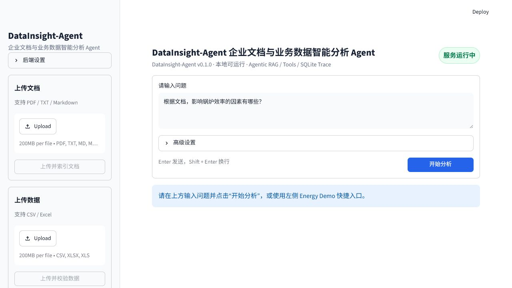
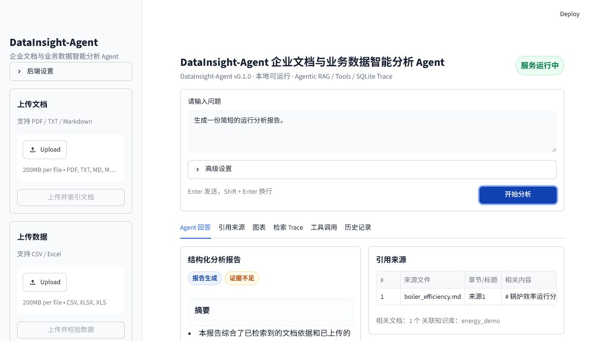
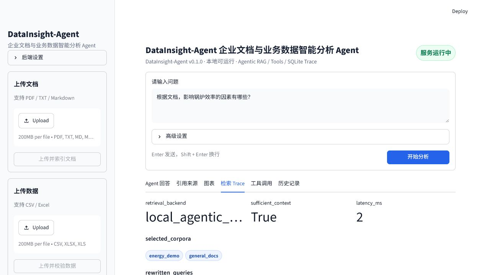
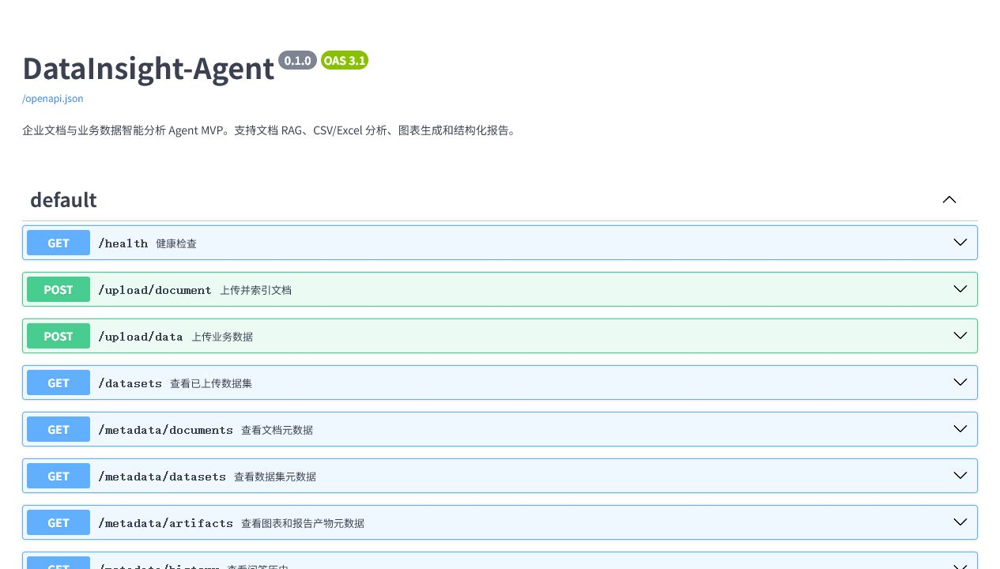
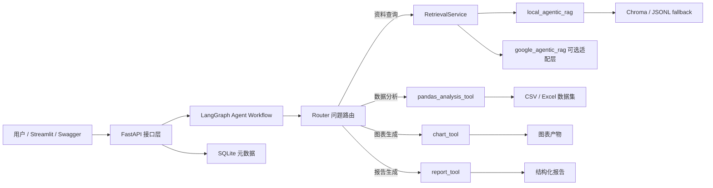

# DataInsight-Agent

> 企业文档与业务数据智能分析 Agent。支持文档 RAG、CSV/Excel 数据分析、图表生成、结构化报告，以及带检索链路追踪的本地轻量 Agentic RAG。

DataInsight-Agent 是一个面向企业知识库和业务数据分析场景的可运行 AI Agent 项目。用户可以上传 PDF、TXT、Markdown 文档和 CSV/Excel 数据，然后用自然语言提问。系统会通过 LangGraph 路由问题类型：

- 查资料：走 Agentic RAG，并返回引用来源和检索 Trace。
- 分析数据：调用 pandas 工具计算指标。
- 生成图表：调用 matplotlib 生成趋势图。
- 生成报告：综合文档证据和数据分析结果，输出结构化报告。

项目默认本地运行，不依赖 Google Cloud 或外部 API Key；可选接入 LLM 和 Google Agentic RAG 适配层。

## Demo 截图

| 中文演示界面 | 结构化报告 |
| --- | --- |
|  |  |

| 检索 Trace | Swagger 接口 |
| --- | --- |
|  |  |

## 核心亮点

- **LangGraph Agent 工作流**：`Router -> RAG / pandas / chart / report`，统一 Agent 输出。
- **本地轻量 Agentic RAG**：包含 query rewrite、corpus router、iterative retrieval、evidence checker、retrieval trace。
- **双后端检索架构**：默认 `local_agentic_rag`，可选 `google_agentic_rag` 适配层，未配置 Google Cloud 时自动回退本地模式。
- **工具调用可追踪**：统一返回 `tool_calls`、`artifacts`、`citations`、`uncertainty`、`latency_ms`。
- **SQLite 元数据管理**：记录上传文档、数据集、图表/报告产物和问答历史。
- **中文 Streamlit Demo**：适合项目演示，展示回答、引用、图表、检索 Trace、工具调用和历史记录。
- **能源动力场景 Demo**：内置锅炉效率、负荷、煤耗、排烟温度和 NOx 数据，体现专业背景差异化。

## 技术栈

```text
Python / FastAPI / Streamlit / LangGraph / Chroma / pandas / matplotlib / SQLite / pytest
```

## 项目结构

```text
DataInsight-Agent
├── app
│   ├── graph              # Router 与 LangGraph 工作流
│   ├── retrieval          # BaseRetriever、local_agentic_rag、google_agentic_rag
│   ├── services           # RAG、LLM、文档解析、向量库、元数据服务
│   ├── tools              # pandas/chart/report 工具封装
│   └── main.py            # FastAPI 接口
├── frontend
│   └── streamlit_app.py   # 中文演示界面
├── examples
│   └── energy_demo        # 能源动力场景文档和 CSV 数据
├── scripts
│   ├── start_local.ps1    # 一键启动 FastAPI + Streamlit
│   ├── stop_local.ps1     # 停止本地服务
│   ├── reset_demo.py      # 清理本地生成数据并重置 Energy Demo
│   ├── ingest_energy_demo.py
│   └── eval_agentic_rag.py
├── docs
│   ├── architecture.md
│   ├── demo_guide.md
│   ├── acceptance_report.md
│   └── assets/screenshots
└── tests
```

## 架构图



## 快速启动

推荐使用 Python 3.11+。

### 1. 创建环境

```powershell
python -m venv .venv
.\.venv\Scripts\python.exe -m pip install --upgrade pip
.\.venv\Scripts\python.exe -m pip install -r requirements.txt
```

也可以使用本机已有虚拟环境，例如：

```powershell
D:\codex\DataInsight-Agent\.venv\Scripts\python.exe -m pip install -r requirements.txt
```

### 2. 一键启动

```powershell
powershell -ExecutionPolicy Bypass -File scripts\start_local.ps1 -VenvPython .\.venv\Scripts\python.exe
```

如果你使用的是 `D:\codex\DataInsight-Agent\.venv`，也可以直接运行：

```powershell
powershell -ExecutionPolicy Bypass -File scripts\start_local.ps1
```

启动后访问：

```text
FastAPI Swagger: http://127.0.0.1:8000/docs
Streamlit UI  : http://127.0.0.1:8501
```

停止服务：

```powershell
powershell -ExecutionPolicy Bypass -File scripts\stop_local.ps1
```

## Energy Demo

重置本地生成数据，并重新导入能源动力 Demo：

```powershell
.\.venv\Scripts\python.exe scripts\reset_demo.py --yes
```

推荐演示问题：

```text
根据文档，影响锅炉效率的因素有哪些？
上传数据中 boiler_efficiency_pct 的平均值是多少？
画出 load_mw 和 boiler_efficiency_pct 的趋势图。
生成一份简短的运行分析报告。
```

## Agentic RAG 输出示例

`POST /ask` 会返回统一 Agent 输出：

```json
{
  "route": "rag",
  "answer": "...",
  "retrieval_backend": "local_agentic_rag",
  "selected_corpora": ["energy_demo", "general_docs"],
  "rewritten_queries": ["...", "..."],
  "retrieval_rounds": [
    {"round_index": 1, "top_k": 4, "accepted_count": 1, "sufficient_context": true}
  ],
  "sufficient_context": true,
  "citations": [{"label": "来源1", "source": "boiler_efficiency.md"}],
  "retrieved_chunks": [],
  "tool_calls": [{"tool_name": "rag_retrieval", "success": true}],
  "latency_ms": 12
}
```

## 检索后端切换

默认本地轻量 Agentic RAG：

```env
RETRIEVAL_BACKEND=local_agentic_rag
```

可选 Google Agentic RAG 适配层：

```env
RETRIEVAL_BACKEND=google_agentic_rag
GOOGLE_CLOUD_PROJECT=
GOOGLE_CLOUD_LOCATION=us-central1
GOOGLE_RAG_CORPUS_IDS=
GOOGLE_APPLICATION_CREDENTIALS=
```

未配置 Google Cloud 时，系统不会崩溃，会返回清晰提示并自动回退到本地 Agentic RAG。

## 可选 LLM

默认 `DATAINSIGHT_LLM_PROVIDER=none`，项目完全本地可运行。配置 OpenAI 兼容 API 后，可以让 RAG 综合回答更自然：

```env
DATAINSIGHT_LLM_PROVIDER=openai
DATAINSIGHT_LLM_BASE_URL=https://api.openai.com/v1
DATAINSIGHT_LLM_API_KEY=你的 API Key
DATAINSIGHT_LLM_MODEL=gpt-4o-mini
```

不要把 `.env` 或任何 API Key 上传到 GitHub。

## SQLite 元数据接口

```text
GET /metadata/documents
GET /metadata/datasets
GET /metadata/artifacts
GET /metadata/history
```

这些接口用于展示系统处理过哪些文档、数据集、图表/报告，以及每次问答的路由、引用、工具调用和检索后端。

## 测试与评测

运行单元测试：

```powershell
.\.venv\Scripts\python.exe -m pytest -q
```

运行 Agentic RAG demo 评测：

```powershell
.\.venv\Scripts\python.exe scripts\eval_agentic_rag.py
```

评测覆盖：

- RAG 召回命中率
- 答案是否包含引用
- Agent 路由准确率
- 响应时间 `latency_ms`
- 证据不足时是否给出提示

## 文档

- [架构说明](docs/architecture.md)
- [功能验收报告](docs/acceptance_report.md)
- [中文 demo guide](docs/demo_guide.md)

## 当前边界

- 默认 embedding 是轻量哈希向量，适合本地 MVP 演示，后续可替换为 BGE/OpenAI embedding。
- Google Agentic RAG 当前是可选适配层，真实云端调用位置已预留。
- 不包含登录、多租户、权限系统和生产级异步任务队列。
- 不执行任意 Python 代码，只提供受控 pandas 分析、图表和报告工具。

## License

MIT License. See [LICENSE](LICENSE).
