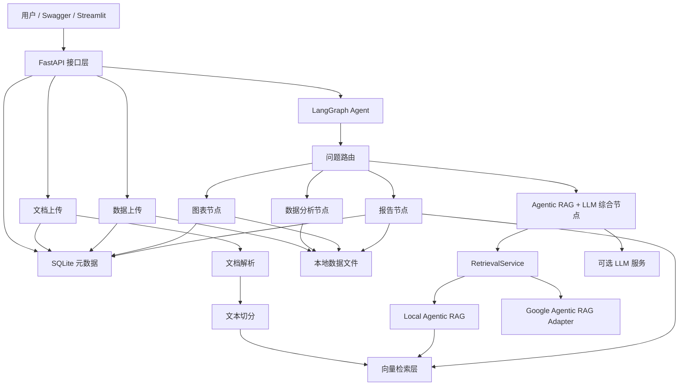

# DataInsight-Agent 架构说明

## 项目目标

DataInsight-Agent 是一个面向企业文档与业务数据分析的 AI Agent MVP。

它要解决的问题是：企业里经常同时存在大量非结构化文档和结构化业务数据。普通聊天机器人只能回答泛化问题，很难同时做到查资料、算指标、画图和生成分析报告。DataInsight-Agent 通过 RAG、pandas 工具和 LangGraph 工作流，把这些能力组织成一个可控的 Agent 系统。

## 整体架构



## 分层设计

### API 层

入口文件是 `app/main.py`，负责对外暴露 HTTP 接口：

- `/health`：检查服务状态。
- `/upload/document`：上传并索引文档。
- `/upload/data`：上传并验证表格数据。
- `/datasets`：查看已上传数据集。
- `/metadata/documents`：查看文档元数据。
- `/metadata/datasets`：查看数据集元数据。
- `/metadata/artifacts`：查看图表和报告产物元数据。
- `/metadata/history`：查看问答历史。
- `/ask`：接收自然语言问题，交给 Agent 工作流处理。

### 展示层

`frontend/streamlit_app.py` 是中文演示界面，负责文件上传、问题输入、结果分 tab 展示和历史记录查看。它优先通过 FastAPI API 获取数据，不直接重写后端业务逻辑。

### 服务层

服务层负责具体能力：

- `document_loader.py`：解析 PDF / TXT / Markdown。
- `text_splitter.py`：把长文本切成适合检索的片段。
- `vector_store.py`：封装 Chroma 和 JSONL fallback。
- `rag_service.py`：执行文档检索并组织引用来源。
- `llm_service.py`：可选调用 OpenAI 兼容接口，把检索片段综合成中文回答。
- `app/retrieval/`：统一检索接口、本地 Agentic RAG、Google 可选适配层。
- `data_service.py`：保存和读取 CSV / Excel。
- `chart_service.py`：生成趋势图。
- `report_service.py`：生成结构化分析报告。
- `metadata_store.py`：使用 SQLite 记录文档、数据集、图表/报告产物和问答历史。

### 工具层

`app/tools/pandas_tool.py` 封装安全的数据分析动作，例如：

- 查看列名。
- 描述统计。
- 平均值。
- 最大值。
- 最小值。
- 相关性分析。

这里不允许大模型直接执行任意 Python 代码，避免安全风险。

工具层通过 `ToolResult` 统一返回结构：

- `tool_name`：工具名称。
- `success`：是否执行成功。
- `summary`：工具执行摘要。
- `data`：结构化结果。
- `artifacts`：图表、文件等产物。
- `uncertainty`：不确定性说明。
- `error`：错误信息。

这样不同工具的输出可以被 LangGraph 节点统一收集到 `tool_calls` 中。

### Agent 编排层

`app/graph/workflow.py` 使用 LangGraph 显式组织工作流：

1. Router 节点判断问题类型。
2. RAG 节点处理资料查询。
3. Data 节点处理指标计算。
4. Chart 节点处理图表生成。
5. Report 节点处理综合报告。

这样做的好处是流程清晰、容易调试，也方便后续扩展更多工具。

Router 不只返回目标路线，还会返回：

- 路由原因。
- 路由置信度。
- 命中的关键词。

这些字段会进入最终 API 响应，方便解释 Agent 为什么调用某个工具。

## SQLite 元数据层

`app/services/metadata_store.py` 使用 Python 标准库 `sqlite3` 管理本地元数据，不引入复杂 ORM。数据库默认位置是：

```text
D:\codex\DataInsight-Agent\sqlite\metadata.sqlite3
```

当前有四张表：

- `documents`：记录上传文档的文件名、类型、corpus、切分片段数和保存路径。
- `datasets`：记录上传 CSV/Excel 的行数、字段列表和保存路径。
- `artifacts`：记录图表、报告等产物，以及它们关联的问题和问答 ID。
- `qa_history`：记录每次 `/ask` 的问题、路由、答案、检索后端、引用、耗时和证据充分性。

这层解决的是工程化可追踪问题：系统不仅能回答问题，还能知道自己处理过哪些文件、产生过哪些结果，以及每次回答用了哪些依据。

## 统一 Agent 输出

`/ask` 接口返回统一输出结构：

- `final_answer`：最终回答。
- `route`：任务路线。
- `router_reason`：路由原因。
- `route_confidence`：路由置信度。
- `matched_keywords`：命中的关键词。
- `tool_calls`：工具调用记录。
- `artifacts`：图表等产物。
- `citations`：RAG 引用来源。
- `uncertainty`：不确定性说明。

这样做是为了让 Agent 不只是给一个答案，而是能解释“为什么这样做、调用了什么工具、产出了什么结果”。

## 为什么 MVP 使用本地哈希 Embedding

第一版目标是“本地能跑通”，不能被外部 API Key 卡住。因此当前使用确定性的本地哈希 embedding 来演示 RAG 流程。它的语义能力不如真实 embedding 模型，但足够证明系统架构。

后续可以替换为：

- OpenAI embedding。
- bge-small / bge-m3。
- text2vec。
- 其他本地向量模型。

只要 `VectorStore` 接口保持稳定，其他模块不用大改。

## 可选 LLM 综合回答

当前 RAG 分为两步：

1. 先从向量库检索相关文档片段。
2. 如果配置了 LLM，则把问题和片段交给大模型生成中文综合回答；如果没有配置，则返回本地检索片段式回答。

这样设计的好处是：

- 没有 API Key 时，项目仍然能完整跑通。
- 有 API Key 时，回答效果更接近真实业务系统。
- 外部模型调用失败时，系统可以自动 fallback，不会影响主流程演示。

接口响应会返回 `llm_used`、`llm_provider` 和 `llm_model`，方便调试和展示。

## 双后端 Agentic RAG

这一阶段把检索模块从“业务代码直接依赖向量库”升级为“统一 RetrievalService”：

- `BaseRetriever` 定义统一检索接口。
- `LocalAgenticRagRetriever` 是默认本地轻量后端。
- `GoogleAgenticRagRetriever` 是 Google Cloud 可选适配层。
- `RetrievalService` 根据 `RETRIEVAL_BACKEND` 选择后端，并负责 Google 未配置时的自动回退。

### 本地轻量 Agentic RAG

本地后端参考 Google Cross Corpus Retrieval 的思想，但不依赖云服务：

1. `query rewrite`：把用户问题改写成多个检索 query。
2. `corpus router`：根据问题选择 `general_docs`、`business_docs`、`data_dictionary`、`energy_demo`。
3. `iterative retrieval`：第一轮证据不足时扩大 top_k 和 corpus 范围。
4. `evidence checker`：判断上下文是否足以回答。
5. `retrieval trace`：返回完整检索过程。

### Google 可选适配层

Google Cloud 文档中的 Cross Corpus Retrieval 使用 agentic retrieval 选择多个 corpus，并通过上下文充分性判断触发检索循环。当前项目只实现适配层和配置检查，不引入 Google Cloud 强依赖。

配置项：

```text
RETRIEVAL_BACKEND=google_agentic_rag
GOOGLE_CLOUD_PROJECT=...
GOOGLE_CLOUD_LOCATION=us-central1
GOOGLE_RAG_CORPUS_IDS=...
GOOGLE_APPLICATION_CREDENTIALS=...
```

如果配置缺失，系统自动回退到 `local_agentic_rag`，并在 `backend_notice` 中说明原因。

## 当前版本边界

当前版本已经具备完整 MVP 闭环，但还不是生产系统：

- 路由器是关键词规则，不是 LLM 意图分类。
- 默认不开启外部 LLM，需要配置 API Key 后才会生成自然语言综合回答。
- Google Agentic RAG 目前是可选适配层，真实云端调用尚未启用。
- 图表字段选择是启发式逻辑。
- SQLite 元数据层是 MVP 版本，还没有用户隔离、分页搜索和复杂审计能力。
- 没有用户系统和权限隔离。

这些限制可以作为后续迭代方向。
